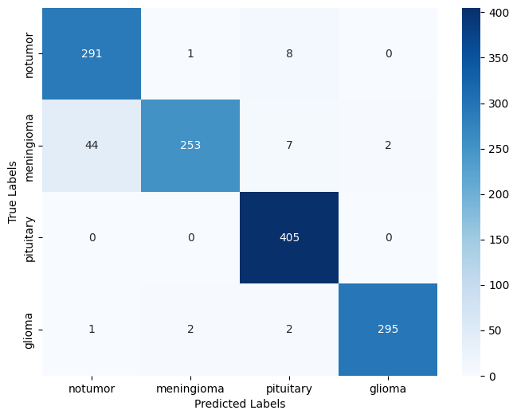
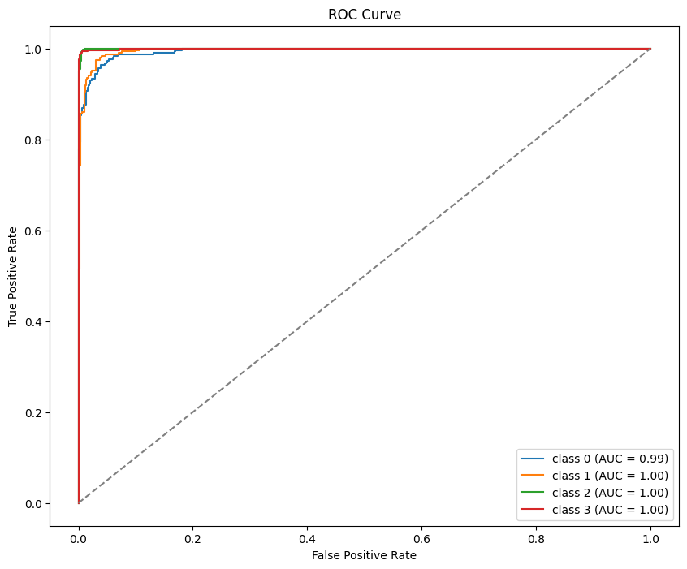

# Brain Tumor MRI Classification using Transfer Learning (VGG16)

An end-to-end deep learning pipeline to classify brain MRI scans into four categories: Glioma, Meningioma, Pituitary, and No Tumor.

## 📌 Features
- **Transfer Learning**: Pre-trained VGG16 architecture fine-tuned on custom MRI data.
- **Data Augmentation**: Custom generator with real-time brightness/contrast adjustments.
- **Model Evaluation**: Includes Confusion Matrix, ROC-AUC Curves, and Classification Report.
- **Inference Pipeline**: Quick visual prediction helper function showing confidence scores.

## 🛠️ Tech Stack
- Python 3.x
- TensorFlow / Keras
- Scikit-learn, NumPy
- Matplotlib, Seaborn, PIL

## 📊 Performance
- **Training Accuracy**: ~91%
- **Loss Metric**: Sparse Categorical Cross-Entropy

### Confusion Matrix & ROC Curve




## 🚀 How to Run

 **Clone the repository:**
```bash
git clone [https://github.com/Bushra-3259/Brain-Tumor-MRI-Classification.git](https://github.com/Bushra-3259/Brain-Tumor-MRI-Classification.git)
```
